# Hi there, I'm Hiron Saha 👋

  

<!-- TIC-TAC-TOE-START -->

  <b>🤖 CPU placed O. Your turn!</b>

  <table align="center" style="border-collapse: collapse; border: none; border-spacing: 4px;">
    <tr>
      <td style="padding: 4px; border: none; background: transparent;">
        
      </td>
      <td style="padding: 4px; border: none; background: transparent;">
        
      </td>
      <td style="padding: 4px; border: none; background: transparent;">
        
      </td>
    </tr>
    <tr>
      <td style="padding: 4px; border: none; background: transparent;">
        
      </td>
      <td style="padding: 4px; border: none; background: transparent;">
        
      </td>
      <td style="padding: 4px; border: none; background: transparent;">
        
      </td>
    </tr>
    <tr>
      <td style="padding: 4px; border: none; background: transparent;">
        
      </td>
      <td style="padding: 4px; border: none; background: transparent;">
        
      </td>
      <td style="padding: 4px; border: none; background: transparent;">
        
      </td>
    </tr>
  </table>

  

<!-- TIC-TAC-TOE-END -->

Senior Software Developer based in India, specializing in enterprise-scale Java backend systems, Spring Boot microservices, distributed messaging architecture, and cloud platforms.

---

### 👾 About Me

- 💻 Currently working as a **Senior Software Developer** at Accenture, designing and optimizing distributed systems.
- ⚙️ Deep expertise in **Java (17/11)**, **Spring Boot**, **Apache Kafka**, **Redis**, and cloud infrastructure (**AWS & GCP**).
- ☁️ Passionate about distributed messaging, high-throughput systems, cloud-native deployments, and AI integrations.
- 🌟 Google Cloud Certified Associate Cloud Engineer & AWS Certified AI Practitioner.

---

### 🛠️ Tech Stack & Systems

| Category | Technologies |
| :--- | :--- |
| **Languages** |      |
| **Frameworks** |     |
| **Messaging & Cache** |    |
| **Databases** |    |
| **Cloud & DevOps** |      |
| **Tools** |     |

---

### 📂 Featured Projects

#### 💬 [ChatApp](https://github.com/hiron1999/ChatApp) — Distributed Real-Time WebSocket Messaging Service
*A highly scalable, real-time messaging backend powered by **Java, Spring Boot 3.x, WebSockets (STOMP), Apache Kafka**, and **Redis**.*
* 🚀 **Horizontal Scaling**: Scales WebSocket servers from 2 to 200+ instances dynamically using Redis for state/room registries.
* ⚡ **Low Latency**: Utilizes Reactive Spring and Lettuce for sub-millisecond connection and broadcasting speeds.
* 🔗 **Resilient Broker Pipeline**: Configured with a 3-broker Apache Kafka cluster featuring active partition replication (`acks=all`) and idempotency for zero-loss message delivery.
* 🛠️ **Tech Stack**: Spring Boot 3, Spring WebSockets, Spring Kafka, Spring Data Redis Reactive, Docker

#### 🎓 [CourseShare](https://github.com/hiron1999/CourseShareFrontend) — Robust Platform for Self-Paced Learning
*A comprehensive online learning platform offering secure, high-performance course uploads and video streaming.*
* 🚀 **Smooth Streaming**: Leverages HTTP Live Streaming (HLS) for uninterrupted video content delivery.
* ⚡ **Async Workflows**: Integrates RabbitMQ for backend task scheduling and messaging notifications.
* 🛠️ **Tech Stack**: Spring Boot 3, React, AWS, RabbitMQ, Docker, Kubernetes

#### 🧠 [QuickLearn AI](https://github.com/hiron1999/Quicklearn/tree/main-) — Privacy-Focused Client-Side Assistant
*A privacy-first, client-side application that runs locally to summarize content and generate interactive quizzes.*
* 🚀 **Local Processing**: Ensures sensitive data never leaves the user's device by running summarization tasks on the client-side.
* 🛠️ **Tech Stack**: JavaScript, HTML5, Tailwind CSS, Client-side LLM APIs | [Live Demo](https://hiron1999.github.io/Quicklearn/)

---

### 🏆 Certifications

- **Google Cloud Associate Cloud Engineer** — [Verification](https://www.credly.com/badges/f881282f-20fc-4ed3-afd4-1882d9e8b394)
- **AWS Certified AI Practitioner** — [Verification](https://www.credly.com/badges/d2bbd3d2-5c0f-4dbc-acd9-7f1b80709064/public_url)
- **Azure AI Engineer Associate** — [Verification](https://learn.microsoft.com/api/credentials/share/en-us/SahaHiron-2741/15167C12D1A3E3ED?sharingId=BAF7D6A77767E1E0)
- **Develop GenAI Apps with Gemini and Streamlit** — [Verification](https://www.credly.com/badges/eb701336-db60-4ccc-85fb-2c1840df24ca/public_url)
- **GitHub Copilot Certification** — [Verification](https://www.credly.com/badges/6cf0eb7a-67dc-46e6-9e34-1d82657adb5b/public_url)

---

### 📊 GitHub Statistics & Activity

  
  &nbsp;&nbsp;
  

---

### 🤝 Let's Connect!

- 📧 **Email**: [hironsaha0@gmail.com](mailto:hironsaha0@gmail.com)
- 💼 **LinkedIn**: [linkedin.com/in/hiron-saha-b7912b198/](https://www.linkedin.com/in/hiron-saha-b7912b198/)
- 🌐 **Portfolio**: [hiron1999.github.io/Portfolio/](https://hiron1999.github.io/Portfolio/)
